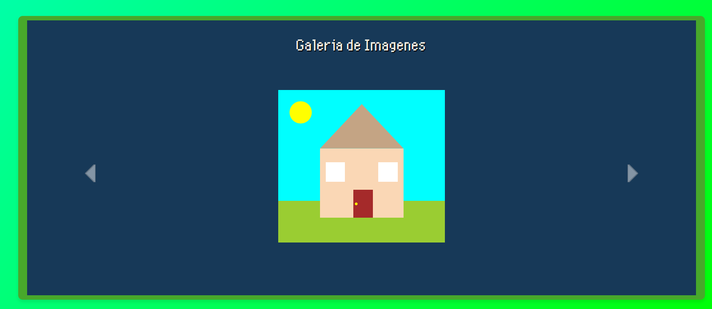
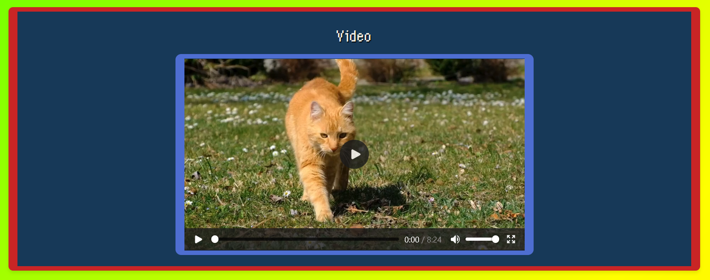
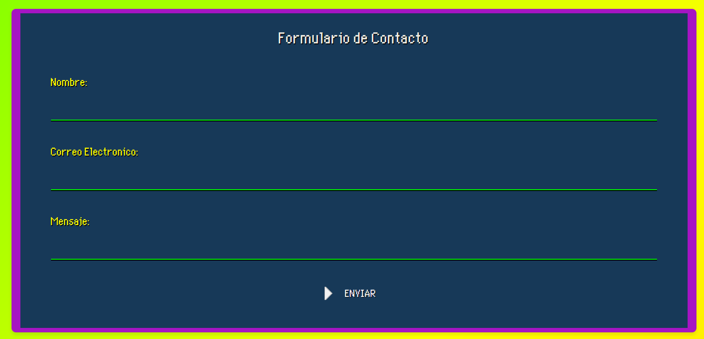

# MP09-UF2-AC4

## Arquitectura:

- **index.html:** Es la landing principal. Contiene toda la estructura principal junto con Bootstrap.
- **script.js:** Fichero JavaScript que se encarga de controlar las interacciones con la página web.
- **styles.css:** Define el diseño y la apariencia de la página.
- **audios:** Contiene los archivos de sonidos/música de la página web.
- **fonts:** Guarda las fuentes personalizadas para la página.
- **icons:** Almacena los iconos que utiliza la página.
- **screenshots:** Guarda las capturas para esta explicación sobre la página web.

## Secciones:

### - Header -

Al ingresar a la página, se muestra esta pantalla de bienvenida.

Al hacer clic a la pantalla, se reproduce la música de fondo y se accede al diseño principal de la página.

Menu principal de la página web, contiene un menu de navegación a las distintas secciones.

### - Galería -

Muestra un carousel con distintos dibujos SVGs diseñados en la AC1.

### - Video -

Esta sección presenta el video que montamos Natalia y yo en la AC3.

### - Formulario -

Contiene un formulario de contacto.

Al introducir los datos y enviarlos, muestra una notificación mediante SweetAlert.

### - Redes Sociales -

Muestra iconos con las distintas redes sociales de la página web.

### - Panel de Volumen -

Adicionalmente, siempre se muestra en la página un pequeño panel con un ícono de volumen.

Al acercar el ratón al ícono, aparece una barra que permite ajustar el volumen de la música de fondo.
